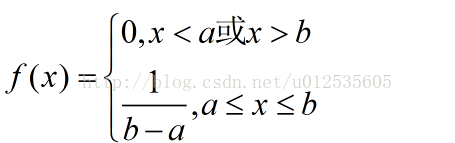

# 6.随机变量及其分布
   随机变量有两种：离散型随机变量、连续性随机变量

   离散型随机变量：随机变量可能取得值是有限个或可列无限个

   连续性随机变量：可能取得值是连续的
   
## 离散型随机变量及其分布律
* 离散型随机变量的定义：
    
    设离散型随机变量$X$所有可能取得值为$x_k(k=1,2,\cdots)$，$X$取各个可能值得概率，
    
    即事件$\{X=x_k\}$的概率，为
    
    $$P\{X=x_k\} = p_k , k=1,2,\cdots$$
    
    由概率的定义，$p_k$满足如下两个条件：

    1. $p_k\geq0,k=1,2,\cdots$
    
    2. $\Sigma^{\infty}_{k=1}p_k=1$

    我们称$P\{X=x_k\}=p_k$为离散型随机变量$X$的分布律

接下来介绍几个离散型随机变量的分布

* **(0-1)分布**

    设随机变量$X$只可能取0与1两个值，它的分布律是

    $$P\{X=k\}=p^k(1-p)^{1-k},k=0,1$$
    
    则称$X$服从以$p$为参数的(0-1)分布

* **伯努利试验**

    设试验$E$只有两个可能结果：$A$与$\overline {A}$，则称$E$为伯努利试验。

    设$P(A)=p$，此时$P(\overline A) =  1-p$.将$E$独立重复进行$n$次，则称这一串重复的独立试验为 **$n$重伯努利试验**。

* **二项分布$X\sim b(n,p)$**

    以$X$表示$n$重伯努利试验中事件$A$发生的次数。由于各次试验是相互独立的，因此事件$A$在指定的$k$次试验中发生，
    
    而$\overline A$则在$n-k$次试验中发生。

    $$p\{X=k\} = C^n_kp^k(1-p)^{n-k}$$

    我们称上式为二项分布的概率质量函数。

    * 均值：
    
        $np$

    * 方差：

        $npq$

* **泊松分布 $X\sim \pi(\lambda)$**

    设随机变量$X$所有可能取得值为0，1，2，...，而取各个值得概率为
    
     $$P\{X=k\} = \frac{\lambda^k e^{-\lambda}}{k!}$$
    其中$\lambda>0$是常数，则称$X$服从参数为$\lambda$的泊松分布，记为$X \sim \pi(\lambda)$

  **二项分布中，n趋近于无穷时，分布律趋近于泊松分布**
## 2.随机变量的分布函数
* 定义：
    
    设$X$是一个随机变量，$x$是任意实数，函数

    $$F(x) = P\{X\leq x\}, -\infty \leq x \leq \infty$$

    称为$X$的分布函数.

    分布函数$F(x)在x$处的函数值表示$X$落在区间$(-\infty,x]$上的概率

## 3.连续性随机变量及其概率密度
* 定义：
    
    对于随机变量$X$的分布函数$F(x)$，存在非负可积函数$f(x)$，使对于任意实数$x$有

    $$F(x) = \int^x_{-\infty} f(t)dt$$

    则称$X$为**连续型随机变量**，$f(x)$称为$X$的**概率密度函数**。

    由定义可知，概率密度$f(x)$具有以下性质：
    
    1. $f(x) \geq0$
    
    2. $\int ^{\infty}_{-\infty}f(x)dx=1$

 

* **均匀分布$X\sim U(a,b)$**
        
    若连续型随机变量$X$具有概率密度函数
        
     
    
            

   则称$X$在区间（a,b）上服从均匀分布。记为$X \sim U(a,b)$

   * 期望$E(X)$：
    $E(X) = \frac{a+b}{2}$

  *  方差$D(X)$：$D(X) = \frac{(b-a)^2}{12}$

* **指数分布**

   若连续性随机变量$X$的概率密度为

    $$f(x) = \begin{cases} \frac{1}{\theta}e^{-x/{\theta}}, & \text {x>0} \\ 0, & \text{其他} \end{cases}$$

   其中$\theta >0$ 为常数，则称$X$服从参数为$\theta$的**指数分布**。

   容易得到随机变量$X$的分布函数为

   $$F(x) = \begin{cases} 1-e^{-x/{\theta}}, & \text{x>0} \\ 0, & \text{其他} \end{cases}$$

* **正态分布 $X \sim N(\mu, \sigma^2)$**
    
    如果随机变量$X$的概率密度为

     $$f(x) = \frac{1}{\sqrt{2\pi\sigma}} e^{-\frac{1}{2\sigma ^2}(x-\mu )^2} , 
     -\infty < x< + \infty$$

    其中，$\sigma >0， \sigma,\mu为常数$， 则称$X$服从参数为$\sigma,\mu$的正态分布，记做$X \sim N(\mu, \sigma^2)$
 
