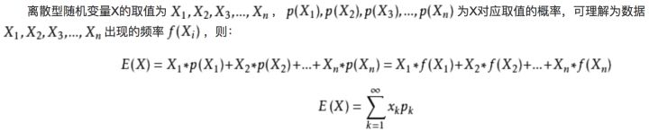
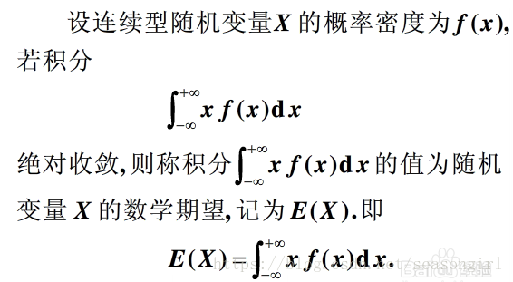

# 1. 2.随机变量的数字特征

## 1.1. 2.1均值
均值中的特征样本是随机变量。

均值是一个统计量(对观察样本的统计)，在数理统计中会提到

* $\color{maroon}{算术平均值}$
  

$$\bar X = {\sum X_i\over N}$$

*  $\color{maroon}{几何平均值}$

$$x=^n\sqrt {\prod_{i=1}^N x_i}$$
## 1.2. 2.2期望
期望是一种概率论概念，是针对于随机变量的一个量。

* **$\color{maroon}{定义公式}$**

**离散型变量**

 

**连续性变量**

 

   通过概念可以看出期望是与概率值联系在一起的。

   大数定律可以将二者连接起来

  **大数定律说明当样本量N趋近于无穷大的时候，样本的平均值无限接近数学期望**

* 定理：

    设Y是随机变量$X$的函数：$Y=g(X),(g是连续函数)$
  
    (i) 如果$X$是离散型随机变量，它的分布律为$P\{X=x_k\}= p_k,k=1,2,\cdots$，若$\Sigma^{\infty}_{k=1}g(x_k)p_k$绝对收敛，则有

    $$E(Y)=E[g(X)] = \Sigma^{\infty}_{k=1}g(x_k)p_k$$

    (ii) 如果$X$是连续型随机变量，它的概率密度为$f(x)$，若$\int^{\infty}_{-\infty}g(x)f(x)dx$绝对收敛，则有

    $$E(Y) = E[g(X)] = \int^{\infty}_{-\infty}g(x)f(x)dx$$

* 期望的性质：
    

    1. 设C是常数，则有$E(C)=C$
    
    2. 设$X$是一个随机变量，C是常数，则有 $E(CX) = CE(X)$

    3. 设$X,Y$是两个随机变量，则有 $E(X+Y) = E(X) + E(Y)$

    4. 设$X,Y$是相互独立的随机变量，则有 $E(XY) = E(X)E(Y)$

 

## 1.3. 2.3方差
为了更好了的研究随机变量与其数学期望的$\color{red}{偏离程度}$，我们引入方差的概念。

* 定义：设$X$是一个随机变量，若$E\{[X-E(X)]^2\}$存在，则称$E\{[X-E(X)]^2\}$为$X$的方差，记为$D(X)$

    $$D(X) = E(X^2) - [E(X)]^2$$
* 方差小意味着$X$的取值比较集中在$E(X)$的附近

* 方差大意味着$X$的取值较分散

* 性质：
  
    1. 设C是常数，则D(C)=0
    
    2. 设X是随机变量，C是常数，则有 $D(CX) = C^2D(X)， D(X+C) = D(X)$

    3. 设$X,Y$是两个随机变量，则有 
    
       $D(X+Y) = D(X) +D(Y) + 2E\{(X-E(X))(Y-E(Y))\}$  

       其中，$E\{(X-E(X))(Y-E(Y))\} = E(XY) - E(X)E(Y)$

       特别，若$X,Y$相互独立，则有

       $D(X+Y) = D(X) +D(Y)$
    
    4. $D(X) = 0$ 的充要条件是$X$以概率1取常数$E(X)$，即
    
        $P\{X=E(X)\} =1$

## 1.4. 2.4 切比雪夫不等式

   设随机变量$X$具有数学期望$E(X)=\mu$，方差$D(X)= \sigma^2$，则对于任意正数$\varepsilon$，不等式

   $$P\{|X-\mu| \geq \varepsilon\} \leq \frac{\sigma^2}{\varepsilon^2}$$

   成立

## 1.5. 2.5 协方差及其相关系数
* 协方差的定义:
  
    量$E\{[X-E[X]]E[Y-E[Y]]\}$称为随机变量$X$与$Y$的协方差，记为$cov(X,Y)$，即

    $$cov(X,Y) =E\{[X-E[X]][Y-E[Y]]\}=E[X*Y] - E[X]E[Y]$$

* 协方差的意义：

    协方差表示的是两个变量的总体的误差，描述两个变量间的相互关联程度（**线性**），这与只表示一个变量误差的方差不同。

    如果两个变量的变化趋势一致，那么这两个变量之间的协方差就是正值。如果两个变量的变化趋势相反，那么两个变量之间的

    协方差就是负值。

* 协方差的性质：

  
    * 当$Cov(X,Y)>0$，称$X$与$Y$正相关，也就是说$X$与$Y$有同时增加或同时减少的倾向。
    
    * 当$Cov(X,Y)<0$，称$X$与$Y$负相关，也就是说$X$增加$Y$减少，有$X$减少$Y$增加的倾向。
    * 当$Cov(X,Y)=0$，称$X$与$Y$不相关，也就是说$X$与$Y$的取值毫无关联，也可能是$X$与$Y$间存在某种非线性关系。

* 协方差的计算：

    * $Cov(aX,bY) = abCov(X,Y)$
    * $Cov(X_1+X_2,Y) = Cov(X_1,Y)+Cov(X_2,Y)$

 

----

**相关系数**
    
   协方差$Cov(X,Y)$是由量纲的量，因此为了消除量纲的影响，现对协方差除以相同量纲的量，就得到一个新的概念——相关系数（**线性**），

   它的定义如下：

  $$Corr(X,Y)=\frac{Cov(X,Y)}{\sqrt{Var(X)}\sqrt{Var(Y)}}=\frac{Cov(X,Y)}{\sigma_X\sigma_Y}$$

   从以上定义可以看出相关系数与协方差是同符号的，这说明从相关系数的取值也可以反映出X与Y的正相关、负相关和不相关。

   **相关系数的另一个解释是：它是相应标准化变量的协方差。**

   * 性质：

       相关系数$Corr(X，Y)$刻画了X与Y之间的线性关系强弱，因此也常称为**线性相关系数**。

       * 若$Corr(X,Y)=1$，称为$X$与$Y$完全正相关。
       * 若$Corr(X,Y)=0$，称$X$与$Y$不相关，也就是说$X$与$Y$的取值毫无关联，但可能存在某种非线性关系。
       
       * 若$0<|Corr(X,Y)| <1$，称$X$与$Y$有一定程度的线性关系。$|Corr(X,Y)|$越接近1，则线性相关程度越高。越接近0，则线性相关程度越低。

这种相关系数有个响亮的名字——Person相关系数。

**参考**

    https://www.zybuluo.com/notmylove/note/1505871

 

## 1.6. 2.6 协方差矩阵
* 引入协方差矩阵

   协方差矩阵一般出现在 **$n$重高斯分布** 的表达式中：

   $$f(x;\mu,C)=\frac{1}{(2\pi)^{\frac{n}{2}}|C|^{\frac{1}{2}}}exp\{-\frac{1}{2}(x-\mu)^TC^{-1}(x-\mu)\} \tag{1}$$
   
   其中$\mu$是列向量$x$的平均值构成的向量，而$C$即协方差矩阵。对于任意列向量$Z$来说，其协方差矩阵的定义为：

   $$Cov(Z)=E[(Z-E(Z))(Z-E(Z)^T] \\
=E[ZZ^T]-(E[Z])(E[Z])^T \tag{2}$$

   得到的矩阵的第$C_{ij}$个变量就是第$i$维的变量和第$j$维的变量的协方差，而且$C_{ij}=C_{ji}$，所以这个矩阵是对称的，而且由这个矩阵的变换功能本身来看，也必定至少是半正定的（$X^TAX>=0$）

   由2式可知，矩阵的第$ij$个元素为

   $$C(z_i,z_j)=E[(z_i-E(z_i))(z_j-E(z_j))]\\
=E[z_iz_j-E(z_i)z_j-E(z_j)z_i+E(z_i)E(z_j)] \\
=E[z_iz_j]-\mu_iE(z_j)-\mu_jE(z_i)+\mu_i\mu_j\\
=E[z_iz_j]-\mu_i\mu_j \tag{4}$$

   因为$E(z)$为常数，所以利用期望的性质$E(C)=C$。

   $$C= \begin{pmatrix}
        C_{11} & C_{12} & C_{13} & \cdots & C_{1n} \\
        C_{21} & C_{22} & C_{23} & \cdots & C_{2n} \\
        \vdots & \vdots & \vdots & \ddots & \vdots \\
        C_{n1} & C_{n2} & C_{n3} & \cdots & C_{nn} \\
        \end{pmatrix}$$

* 协方差矩阵的意义

   描述不同维度之间的关系。