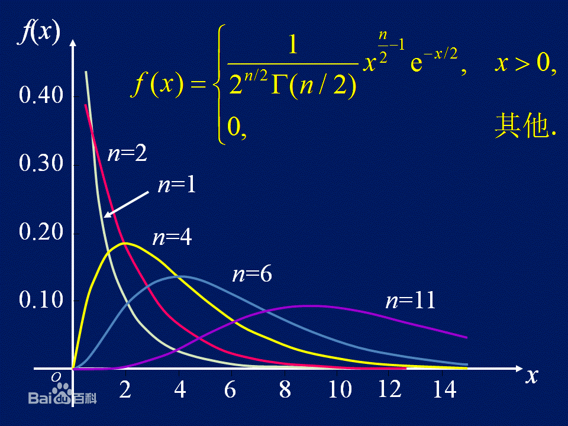
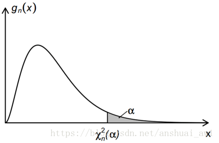
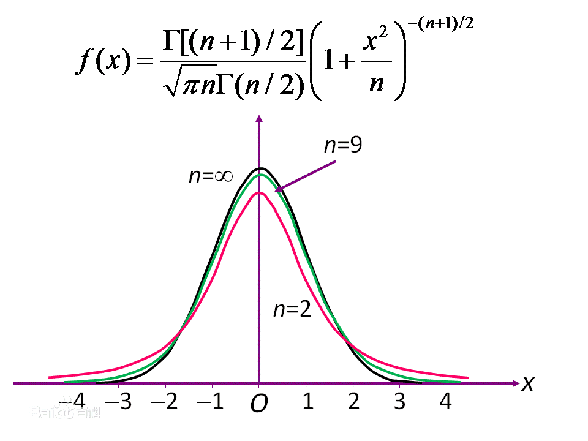
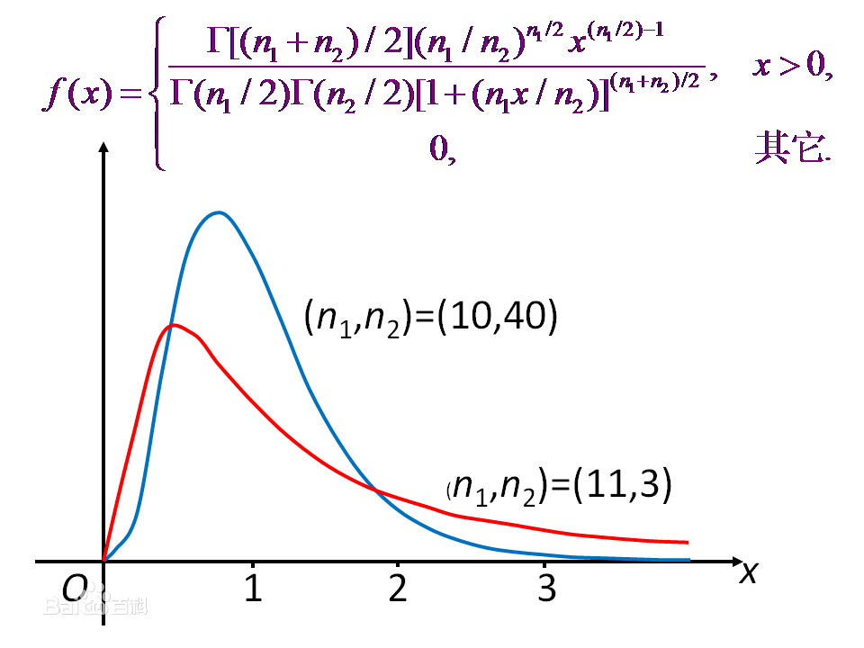

# 1. 7.样本及抽样分布

## 1.1. 基本概念
<1> **简单随机样本** 
> **Definition :**
>
> 设X是具有分布函数F的随机变量，若$X_1,X_2, \cdots, X_n$是具有同一分布函数F的、相互独立的随机变量，
>
> 则称$X_1, X_2, \cdots ,X_n$为分布函数F得到的容量为n的简单随机样本，简称样本。

<2> **样本值**
> **Definition :**
>
>样本的观察值$x_1,x_2, \cdots, x_n$称为样本值，所以我们可以把样本看成是n个变量。

 

**$X_1,X_2,  \cdots, X_n$相互独立，且它们的分布函数都是$F$，所以（$X_1, X_2, \cdots , x_n$）的分布函数为**

$$F^*(x_1, x_2, \cdots, x_n) = \prod_{i=1}^n F(x_i)$$

**其概率密度也是一样进行累乘计算的**

## 1.2. 几种常用的统计量
**统计量：** 是样本的函数，函数中不含未知参数，可以反映总体的一些特征。如果样本是水果，则统计量是榨出来的果汁。

**样本平均值**

$$\bar X=\frac{1}{n}\sum_{i=1}^{n}X_i$$

**样本方差**

$$S^2=\frac{1}{n-1}\sum_{i=1}^{n}(X_i-\bar X)^2$$

**样本k阶原点矩（当k=1时，就是样本均值了）**

$$A_k=\frac{1}{n}\sum_{i=1}^{n}X_i^k$$
**样本k阶中心距**

$$B_k=\frac{1}{n}\sum_{i=1}^{n}(X_i - \bar X)^k$$

**其中， 样本均值与样本方差是最为重要的统计量。**

## 1.3. 三大抽样分布
统计量的分布称为抽样分布。

参考[知乎](https://www.zhihu.com/question/35756587/answer/140286352)的解释：

**抽样分布是针对一个总体N，用固定的样本容量进行多次抽样，得到的一个有关样本方差、均值（统计量）的组合。**

接下里介绍一些几大分布。

<1> **卡方分布（$\chi^2$）**
> **Definition :**
> 
> 设$X_1,X_2, \cdots , X_n$是来自总体$N(0,1)$的样本，则称统计量$\chi^2 = X_1^2 + X_2^2 + X_3^2 + \cdots  + X_n^2$服从自由度为$n$的$\chi^2$分布，记为$\chi^2 \sim \chi^2(n)$
> 
> 自由度为上式右端包含的独立变量的个数

其中， $\Gamma$为$Gamma$函数

接下来列举一下$\chi^2$分布的性质

* **$\chi^2$的可加性**   
  
    设$\chi_1^2 \sim \chi^2(n_1), \chi_2^2 \sim \chi^2(n_2)$，并且$\chi_1^2,\chi _2^2$相互独立，则有$\chi_1^2 + \chi_2^2 \sim \chi^2(n_1 + n_2)$

* **$\chi^2$分布的数学期望和方差** 

   若$\chi^2 \sim \chi^2(n)$，则有

$$E(\chi^2) = n,  D(\chi^2) = 2n$$

* **$\chi^2$分布的上分位点** 

   对与给定的正数$a,0<a<1$，满足条件 $P\{\chi^2 > \chi^2_a(n)\} = \int^{\infty}_{\chi^2_a(n)} f(y)dy = a$
   
   的点$\chi^2_a(n)$就是$\chi^2(n)$分布的上$a$分位点

 

<2> *t*分布
> **Definition :**
>
> 设$X \sim N(0, 1), Y\sim \chi^2(n)$，且$X,Y$相互独立，则称随机变量
>
> $$t=\frac{X}{\sqrt{(Y/n)}}$$
> 服从自由度为n的*t*分布，记为 *$t \sim t(n)$* ， 又称为学生氏分布

<3> $F$分布

> **Definition :**
> 
> 设$U \sim \chi^2 (n_1), V \sim \chi^2(n_2)$，且$U,V$相对独立，则称随机变量
> 
> $$F=\frac{X/n_1}{Y/n_2}$$
> 服从自由度为$(n_1, n_2)$的$F$分布，记为$F \sim F(n_1, n_2)$

## 1.4. 正态总体的样本均值与样本方差的分布
* 设$X_1, X_2,\cdots, X_n$是来自总体$X$（无论是什么分布）的样本，且有$E(x) = u, D(x) = \sigma^2$，则有

$$E(\bar X ) = E(\frac{1}{n}\Sigma X_k) = \frac{1}{n}E(\Sigma X_k) = \frac{1}{n} n E(X_k) = E(X_k) = E(X) = u,
\\
D(\bar X) =  D(\frac{1}{n} \Sigma X_k) = \frac{1}{n^2} n D(X_k) =\frac{\sigma^2}{n}$$

* 设总体$X \sim N(\mu , \sigma^2),X_1,X_2, \cdots, X_n$是来自$X$的样本，则有

1、 $\bar X \sim N(\mu, \sigma^2/n)$

2、 $\frac{(n-1)S^2}{\sigma^2} \sim \chi^2(n-1)$

3、 $\bar X$与 $S^2$相互独立

4、 $\frac{\bar X - \mu}{S / \sqrt{n}} \sim t(n-1)$

* 对于两个正态总体 $X \sim N(\mu_1, \sigma^2), Y \sim N(\mu_2, \sigma^2)$，有

$$\frac{S_1^2/\sigma_1^2}{S_2^2/\sigma_2^2} \sim F(n_1-1,n_2-1)$$

 
$$
\frac{(\bar X-\bar Y)-\mu_1-\mu_2}{S_w\sqrt{\frac{1}{n_1}+\frac{1}{n_2}}}\sim t(n_1+n_2-2)
$$
其中
    
$$
S_w^2=\frac{(n_1-1)S_1^2+(n_2-1)S_2^2}{n_1+n_2-2}
$$
