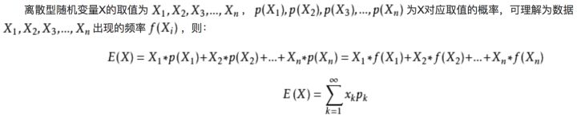

# 2.均值与期望

## 2.1均值
均值中的特征样本是随机变量。

均值是一个统计量(对观察样本的统计)，在数理统计中会提到

* $\color{maroon}{算术平均值}$
    
$$\bar X = {\sum X_i\over N}$$
*  $\color{maroon}{几何平均值}$
 
$$x=^n\sqrt {\prod_{i=1}^N x_i}$$
## 2.2期望
期望是一种概率论概念，是针对于随机变量的一个量。

* $\color{maroon}{定义公式}$

通过概念可以看出期望是与概率值联系在一起的。

## 2.3大数定律
大数定律可以将二者连接起来

**大数定律说明当样本量N趋近于无穷大的时候，样本的平均值无限接近数学期望**