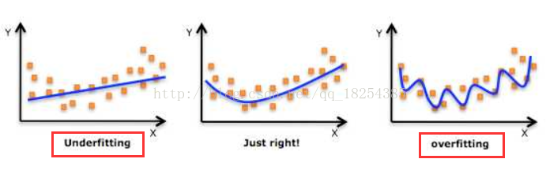

# 拟合问题

## 1.欠拟合与过拟合
在讲述这两者的概念之前，先来体会一下一张图片

* 过拟合：所建立的机器学习模型在训练样本中表现的过于优越，导致在验证数据以及测试数据中表现不佳。

## 2.防止过拟合
* 正则化

    在经验风险后再加上一个正则化项。
    
    正则化项一般是模型复杂度的单调递增函数，模型越复杂，正则化值就越大。
    
    

    其中，第1项是经验风险，第2项是正则化项，$\lambda \geq 0$ 为调整两者之间关系的系数
    
    而正则化项，可以参考范数的那篇笔记。
    
     
    
* 交叉验证

    如果给的数据集充足，可以随机地将数据集切分成三部分，分别为训练集，验证集，测试集。

    训练集用来训练模型，验证集用于模型的选择，测试集用于最终对学习方法的评估。
    
    * **思想：**
        
        重复地使用数据；把给定的数据进行切分，将切分的数据集组合为训练集与测试集，再次基础上反复地进行训练、测试与模型选择。

    * **简单交叉验证**
        
        随机地将数据分为两部分，一部分作为训练集，另一部分作为测试集（70%训练集，30%测试集）

    * **$S$折交叉验证**

        将数据切分为$S$个互不相交的大小相同的子集，然后利用$S-1$个子集的数据训练模型，利用余下的子集测试模型；
        
        将这一过程对可能的$S$种选择重复进行；最后选出$S$次评测中平均测试误差最小的模型。

       $\color{red}{C_{S-1}^S = S}$

    * **留一交叉验证：**

        $S$折交叉验证的特殊情况是$S=N$，即为留一交叉验证