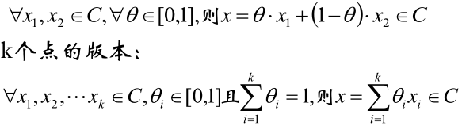

# 凸函数
## 1.概念
* 1.1 超平面：在高维空间中，有一个面可以将不同类别的样本完全分开的平面。
* 1.1 支持向量：那些距离超平面最近的点就是支持向量。

## 2 凸集
* **凸集：** 若集合C内任意两点间的线段均在集合C内，则称集合C为凸集

    定义的数学语言版：

* **下面来判断一些图是否为凸集**

* **上图的第一排：**
    * 第一个：是凸集
    * 第二个：不是凸集
    * 第三个：不是凸集，有些边没有包含集合的话也不能叫凸集

## 3 凸函数
* 首先给出凸函数的图像

* **定义：**

    若函数f的定义域domf 为凸集，且满足

     ∀x,y ∈ domf，0≤θ≤1，有

     f(θx + (1-θ)y) ≤ θf(x) + (1-θ)f(y)       **式1**
    
    则这样的函数f就是凸函数

* **θx + (1-θ)y：** 代表x和y之间的某个点。

* **式1**的左边就是函数f

* **式1**的右边就是点(x,f(x))和点(y,f(y))之间的线段

* 于是定义就是表达：如果“函数f上任意两点的连线”在“函数f这两点之间的函数f图像”上面的话，这样的函数就是凸函数。

    也就是说：“如果线段在函数上方，那这样的函数就是凸函数”。

* 若函数的二阶导数在区间上非负，则称为凸函数，若二阶导数在区间上恒大于0，则称为严格凸函数

* **注意：**
    * **如果一个函数是凸函数，则该函数的图像上方区域一定是凸集。反过来也成立，即：如果一个函数图像上方的集合是凸集，那么该函数为凸函数**

    * 凸集并不一定都能对应到凸函数，因为函数的最根本条件是：对于函数y=f(x)，只有一个y，如下图所示：
      
        
        
        取点x1，在经过圆构成的凸集时产生了2个y，这与函数的最根本条件产生了冲突
    
* 一些常见的凸函数有：
  
    

## 4、正定矩阵与半正定矩阵
* **正定矩阵：** 给定一个大小为 $n\times n$的实对称矩阵$A$，若对于任意长度为$n$的非零向量$X$，有$X^TAX>0$恒成立，则矩阵$A$是一个正定矩阵
* **半正定矩阵：** 给定一个大小为$n\times n$的实对称矩阵$A$，若对于任意长度为$n$的非零向量$X$，有$X^TAX>=0$恒成立，则矩阵$A$是一个正定矩阵
    * 半正定矩阵的所有主子式均为非负的
    * 半正定的特征值均为非负的

## 5、对偶问题
* **优点：** 
    * 对偶问题往往更容易求解
    
    * 自然引入核函数，进而推广到非线性分类问题

