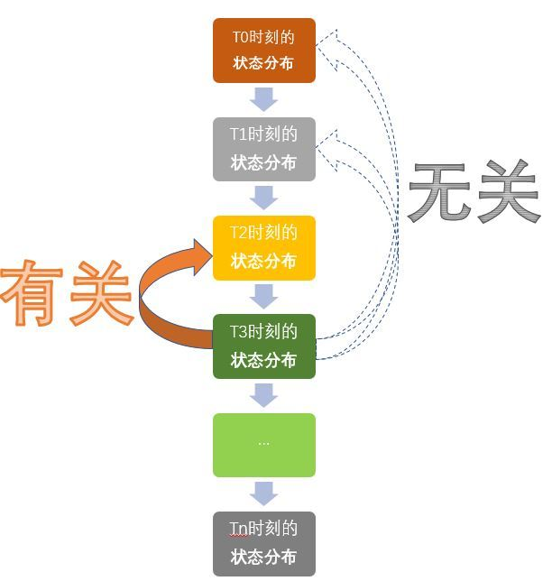

# 1.马尔科夫链
首先，我们先引入**马尔科夫性**，再通过马尔科夫性引入**马尔科夫过程**，最后再是**马尔科夫链**

## 1.1 马尔科夫性
* 定义：过程在时刻$t_0$所处的状态为已知的条件下，过程在时刻$t > t_0$所处的状态的条件分布与过程在时刻$t_0$之前所处的状态无关。

    换句话说，就是下个状态只与当前状态有关，与前面状态无关。这里的过程均为随机过程。

* 用数学形式表达如下：

$$P[S_{t+1}|S_t] = P[S_{t+1}|S_1, ..., S_t]$$

## 1.2 马尔可夫过程
* 定义：具有马尔可夫性的过程，即过程的条件概率仅与系统的当前状态相关，而与它的过去历史或未来状态都是独立、不相关的。

## 1.3 马尔可夫链
* 定义：时间和状态都是离散的马尔可夫过程称为马尔可夫链。
   
   在其每一步中，系统根据概率分布可以从一个状态变到另一个状态，也可以保持当前状态。状态的改变叫做转移，与不同的状态改变相关的概率叫做转移概率。

