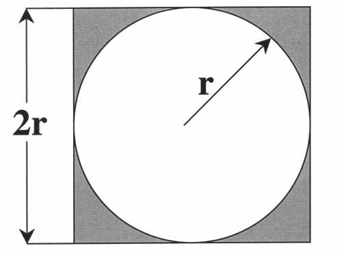
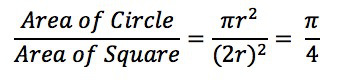
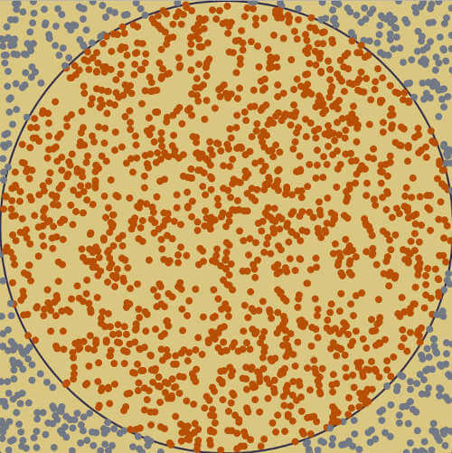

# 1. 6.蒙特卡罗方法
可以在随机采样上计算得到近似结果，随着采样的增多，得到的正确结果的概率也逐渐增大。

* **采样越多，越近似最优解**

## 1.1. $\pi$的计算

如何用蒙特卡罗方法计算圆周率$\pi$

正方形内部有一个相切的圆，它们的面积之比是$\pi /4$

现在，在这个正方形内部，随机产生10000个点（即10000个坐标对（x，y）），计算它们与中心点的距离，从而判断是否在圆的内部。

如果，这些点都均匀分布，那么落在圆上的概率为$\pi/4$，那么我么可以就可以去算出$\pi$的值了，即将比值乘以4。

## 1.2. 拉斯维加斯法
* 采样越多，越有机会找打最优解

例如，我有100把钥匙，只有1把是对的，于是我每次随机拿1把去试，打不开就换一把，我试的次数越多，就越接近最优解。

**参考**

    http://www.ruanyifeng.com/blog/2015/07/monte-carlo-method.html
