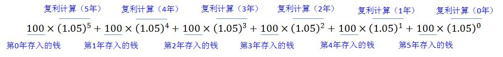

# 1. 8.卷积

## 1.1. 卷积的物理意义
参考知乎的答案

小明存入100元钱，年利率是5%，五年之后的钱变成了$100(1+5\%)^5$，如下表：

将这笔钱存入银行的一年之后，小明又往银行中存入了100元，年利率还是5%，到了第五年，钱就变成了$100(1+5\%)^{4}$，如下表：

以此类推，之后的每年都放如100元钱，如下图：

最终，小明拿到的钱等于他各年存入的钱分别计算复利之后得到的钱数的总额，即

用求和符号来简化这个公式，可以得到：

$$\large{\sum_{i=1}^nf(i)g(5-i), where f(i) = 100 , g(5-i) = (1.05)^{5-i}}$$

在上式中，$f(i)$为小明的存钱函数，而$g(i)$为存入银行的每一笔钱的复利计算函数。**在这里，小明最终得到的钱就是他的存钱函数和复利计算函数的卷积。**

我们将这个公式推广到连续的情况，也就是，小明在0到$t$的这一段时间内，每时每刻都往银行里存钱，他的存钱函数为$f(\tau)(0\leq  \tau \ leq t)$，而银行也对他存入的每一笔钱按复利公式计算利益:$g(t-\tau) = (1+5\%)^{t-\tau}$，则小明到时间$t$将得到的总钱数为

$$\large{\int_0^t f(\tau)g(t-\tau)d\tau = \int_0^tf(\tau)(1+5\%)^{t-\tau}d\tau}$$

以上就是卷积公式了，可以记为$(f*g)(t)$

如果我们将小明的存款函数$f(t)$视为一个**信号发生（就是激励）**的过程，而将复利函数$g(t-\tau)$视为一个**系统对信号的响应函数（就是响应）**，那么二者的卷积$(f*g)(t)$就可以看做是在$t$时刻对系统进行观察，得到的观察结果将是过去产生的所有信号经过系统的【处理/响应】后得到的结果的叠加，这就是卷积的物理意义了。

 

**参考**

>[1][卷积的物理意义是什么？](https://www.zhihu.com/question/21686447?nr=1)

>[2][最容易理解的对卷积(convolution)的解释](https://blog.csdn.net/bitcarmanlee/article/details/54729807)

>[3][如何通俗易懂地解释卷积？](https://www.zhihu.com/question/22298352?rf=21686447)
